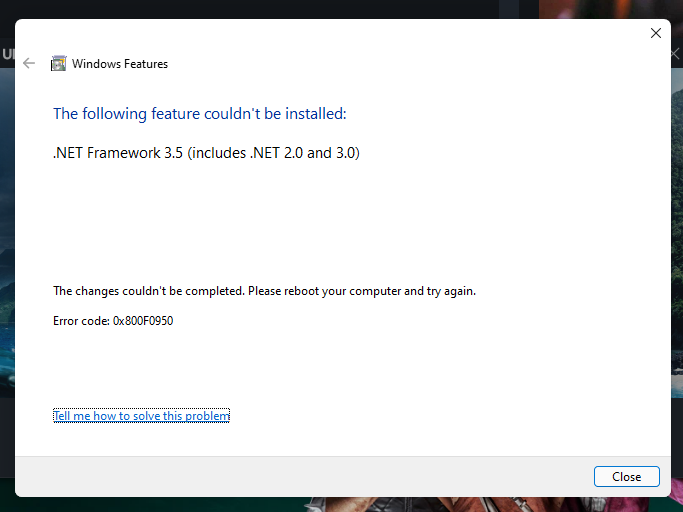

## Windows 11 .NET Framework 3.5 Offline Installer
This tool will help you to install .NET Framework 3.5 on Windows 11.

## Are you facing this issue?

If yes, then you have to take the next steps.

## Steps
1. Download this tool from [**Here**](https://github.com/akbarhabiby/Windows11_dotNET-3.5/archive/refs/tags/v1.1.zip) or you can clone this repository.
2. Extract it anywhere, or better you move the extracted folder into `C:`.
3. Open **`app`** folder
3. Then run **`start.bat`** **as administrator**
4. And.. Voila! Congratulations, you now have **`.NET Framework 3.5`** on your System!
